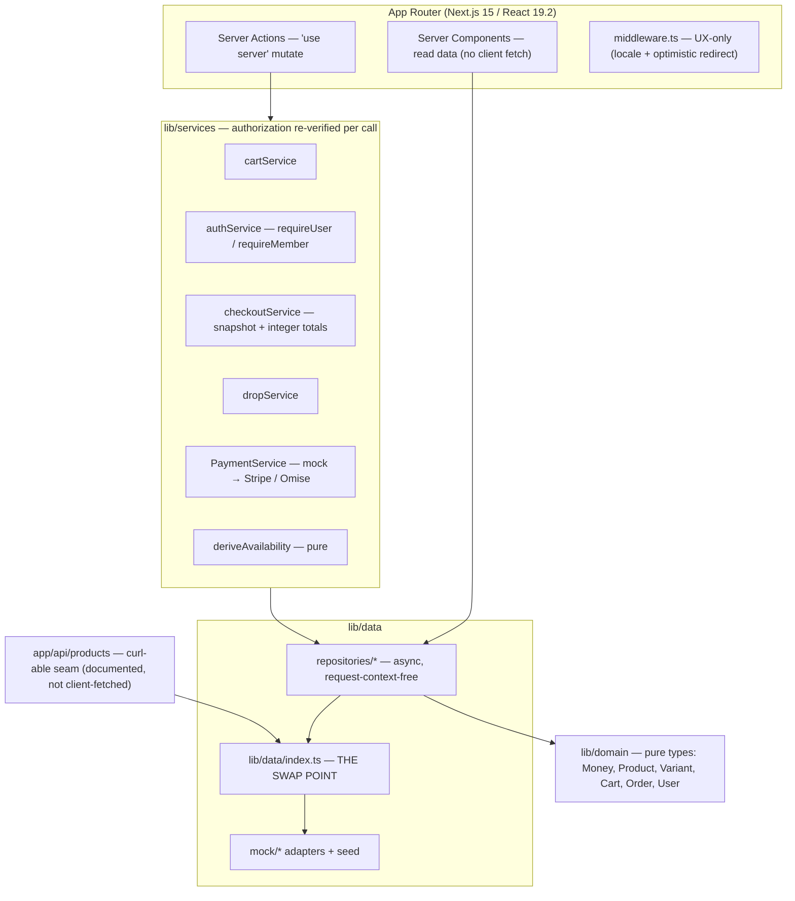
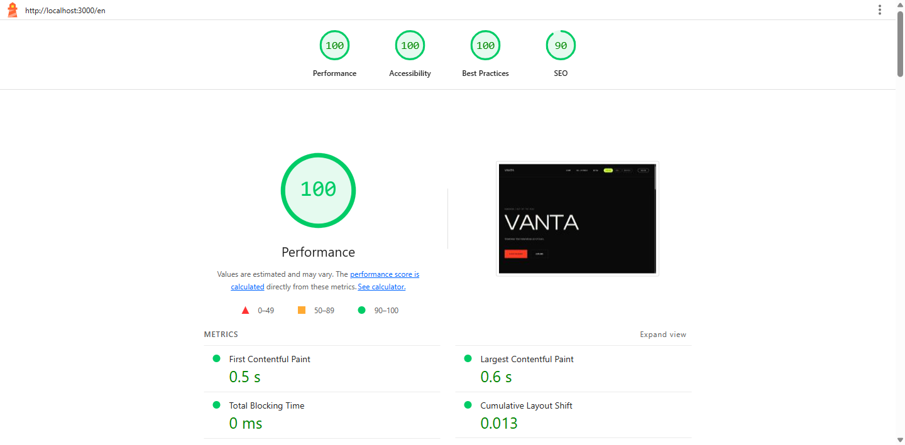

# VANTA®

> **Bangkok-born. Globally worn.** A bilingual (EN / TH) streetwear storefront —
> a portfolio piece that proves senior **application architecture**: a real,
> stateful store (cart, auth, inventory, live drops, checkout) built so a real
> backend plugs in by changing **one import**, not by rewriting the UI.

**Live demo:** _deploy with `npx vercel --prod` (see [DEPLOY.md](docs/case-study/DEPLOY.md))_
· **Demo member:** `member@vanta.shop` / `vanta-demo` (shown on `/login`)
· **Seeded order:** [`/en/checkout/ord_seed_demo`](http://localhost:3000/en/checkout/ord_seed_demo) walks the confirmation instantly.

---

## Why this exists

Most storefront demos are a pretty front end wired to nothing — or a CRUD admin
with no taste. VANTA is the harder middle: a storefront that **feels** like a hyped
drop *and* is wired like production. Every interaction reads and mutates real
domain state through a layered data seam, so the jump from mock to a live database
is mechanical — not a rewrite.

## The hero: LIVE DROP

One pure function is the spine of the whole experience:

```ts
deriveAvailability(variant, drop, now, user)
//   → 'coming_soon' | 'early_access' | 'live' | 'low_stock' | 'sold_out'
```

It is read **identically** by the home hero, the catalog cards, the PDP, and the
marquee — but the home/PDP use a single-variant **precedence** order while catalog
cards use a different **roll-up** order (a sold-out size shouldn't black out a card
that still has stock). The countdown flips the drop to `live` at a real timestamp,
`early_access` unlocks for the seed member before the public, and stock ticks down
on add-to-cart until `low_stock` (≤ 5) and finally `sold_out`.

## Architecture — the seam is the selling point



**The swap point is [`lib/data/index.ts`](lib/data/index.ts).** Today it wires the
repositories to the mock adapters:

```ts
export const repositories: Repositories = mockRepositories;
```

### How a real backend plugs in (change one import)

Swap `mockRepositories` for a `prismaRepositories` bundle backed by **Prisma +
Postgres** (or `apiRepositories` calling a **NestJS** service). Auth swaps the
`authService` adapter for **OAuth** (Auth.js); the `PaymentService` seam targets
**Stripe / Omise** with **webhook** order reconciliation. The Server Components,
Server Actions, components, and domain types are untouched — **only
[`lib/data/index.ts`](lib/data/index.ts) changes.** The repository interfaces are
deliberately `async` and request-context-free, so a network/DB implementation
drops in without touching a single call site.

### See the seam yourself

```bash
curl -s http://localhost:3000/api/products | jq '.[0].slug'
```

This route is **documented for reviewers only** — the UI never client-fetches
`/api`. Server Components read the repositories directly; the route just
re-exposes the *same* seam over HTTP so the one-import story is checkable.

## Decisions a reviewer should notice

- **Authorization lives in the service / Server-Action layer, never in
  middleware.** `requireUser` / `requireMember` are re-verified on every mutate.
  Middleware only does locale routing and an *optimistic* redirect — it is not the
  security boundary (it deliberately sidesteps the class of bug behind
  CVE-2025-29927).
- **The cart's source of truth is a signed cookie**, read by Server Components.
  Zustand is a *disciplined mirror* updated only from Server Action returns, with
  `useOptimistic` for the in-flight add — so the badge never lies after a reload.
- **Money is integer minor units** (`{ amount, currency: 'THB' }`, satang). No
  floats touch a price; THB renders with no decimals. Order line items are
  **snapshots** — a later price or product change can't rewrite history.
- **Bilingual is structural, not bolted on.** EN and TH share one key-isomorphic
  message tree and the *same* DOM / test ids, so the hero slice passes in both
  locales. Dates are forced to the `gregory` calendar; Thai display type (Kanit)
  is paired with a Latin display face (Clash Display).
- **Motion is a first-class preference, not an afterthought.** A persisted
  `system / full / reduced` toggle drives one capability hook; every reveal is
  *visible-by-default* and animates in, so reduced-motion and no-JS never strand
  content at `opacity: 0`. Verified by a dedicated Playwright reduced-motion
  project.

## Quality

- **Vitest (355 tests)** — `deriveAvailability` precedence, money / date
  formatting, cart reconciliation, the repository swap, checkout snapshot +
  integer totals, auth guards, the design-token contrast guard, and the `/api`
  seam.
- **Playwright** — the full hero slice (browse → PDP → add → checkout →
  confirmation) in **EN *and* TH** (proving locale-stable DOM), plus a
  **reduced-motion** project asserting nothing is stranded hidden.
- **Lighthouse** — one local run on `/en`:

  

## The senior story (three pieces, one arc)

- **AETHER** — visual **craft**: award-tier WebGL interaction & motion.
- **VANTA** (this repo) — application **architecture**: a backend-ready store with
  a one-import swap seam.
- **Astro site** — the **backend** discipline (i18n, deploy, performance) behind
  both.

## Run locally

```bash
npm install
npm run dev        # http://localhost:3000/en
npm test           # Vitest (lib/** + the /api seam)
npm run test:e2e   # Playwright (en / th / reduced-motion)
```

## Stack

Next.js 15 (App Router) · React 19.2 · TypeScript (strict) · Tailwind CSS v4 ·
GSAP · Zustand (disciplined mirror) · next-intl · Vitest + Playwright · Vercel.

---

<sub>Portfolio showcase. The data layer is mock-backed by design — the point is the
seam, not the database. See [`docs/case-study/`](docs/case-study/) for the
architecture diagram, deploy checklist, and Lighthouse evidence.</sub>
